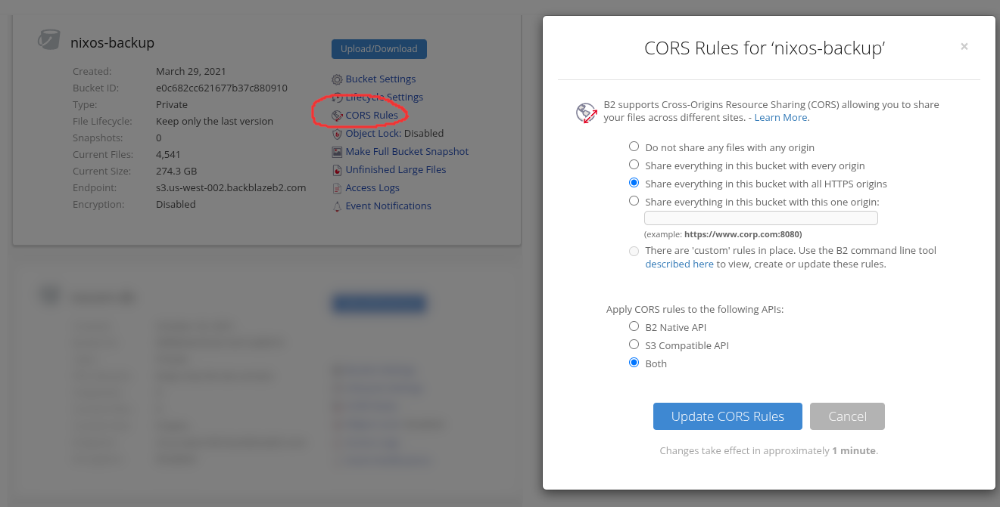
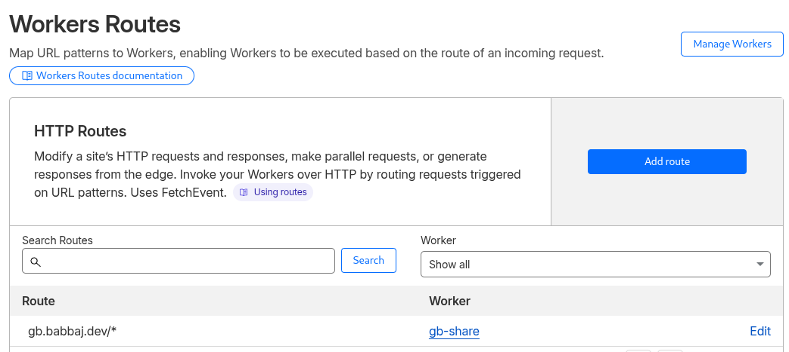

# GB SHARE
`gb share` allows backed up files to be downloaded in a browser from s3 through [presigned urls](https://docs.aws.amazon.com/AmazonS3/latest/userguide/ShareObjectPreSignedURL.html)
without compromising on security or convenience

By default `gb share` will generate a url to https://leijurv.github.io/gb/share with a long set of url parameters that the javascript 
can use to download, decrypt, and decompress a file. This requires no setup from the user and gb doesn't have to make any requests
to any servers for it to work

To allow for persistent and short URLs this directory includes everything needed to setup a cloudflare worker that serves
a copy of the website that stores all of the file information in your s3 bucket, to be looked up using a short randomly generated string

The following sections will explain how to setup the worker

### S3 CORS
For the browser to be able to make requests to s3 from github pages or your domain, CORS has to be configured in your 
bucket to allow files to be shared to other origins


## Deploying with wrangler
### Setup wrangler
Install wrangler with your package manager or `npm install -g wrangler`

run `wrangler login` 

wrangler will open a browser window to log into cloudflare

### Deploy
```
npm install
wrangler deploy
wrangler secret bulk <<< "$(gb wrangler-secrets)"
```
`gb wrangler-secrets` automatically generates all the secrets needed to run the worker. 
You will be prompted to provide a new S3 key just for the worker but this is optional but recommended.
S3 presigned urls can only be revoked by revoking the key that was used to make them

### 4. Configure the worker route
Your domain needs to be proxied by cloudflare and your domain needs to be configured to use your worker.
You can do this by creating a workers route. My configuration looks like this
